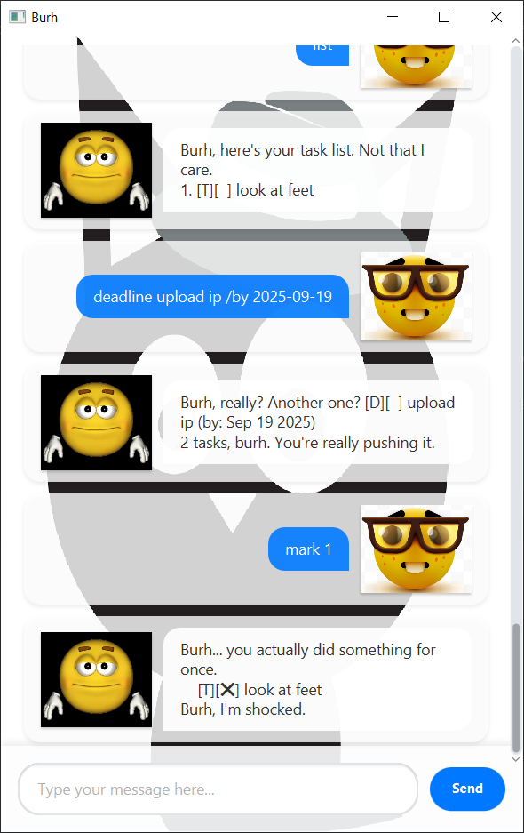

# Burh User Guide



> "Burh..." - Burh 😑

**Burh** helps you to keep track of your tasks ~~unwillingly~~! It's 
- *text-based*
- *easy to learn*
- **Not forced to do it**

All you need to do is,

1.  Go to this [page](https://github.com/goh-joshua/ip/releases/tag/v0.0.1)
2. Download it
3. Go to its location in the CLI and run:
```ruby
java -jar Burh.jar
```
4. Burh 🎉🎉🎉

## Features
- [X] Creates different tasks
- [X] Mark and unmark tasks
- [X] Delete tasks
- [X] Search for keywords in tasks
- [X] Sort tasks 

## Creating Todo Tasks

Make it create to-do tasks!

**Syntax:** `todo <task_description>`

**Example:** `todo cook eggs`

## Creating Deadline Tasks

Make it rememeber urgent matters!

**Syntax:** `deadline <task_description> /by <due_date>`

**Example:** `deadline upload ip /by 2025-09-19`

## Creating Deadline Tasks

Also make it rememeber events you can be bothered to rememebr yourself!

**Syntax:** `event <event_description> /from <start_date> /to <end_date>`

**Example:** `event do ip /from 2025-09-14 /to 2026-09-19`

## Viewing Your Tasks

Make it list out all your tasks!

**Command:** `list`

**Output:**
```
1. [T][ ] cook eggs
2. [D][ ] upload ip (by: Sep 19 2025)
3. [E][ ] do ip (from: 20 Mar 2026 1900 to: 20 Mar 2026 2300)
```

## Managing Tasks 

Make it manage the status of you tasks!

**Syntaxs:** `mark <task_id>` or `unmark <task_id>`

**Example**
- `mark 1` - marks task 1 as complete
- `unmark 2` - marks task 2 as incomplete

## Finding specific tasks

Make it find tasks you can barely rememeber!

**Syntax:** `find <search_term>`

**Example:** `find ip`

## Removing Tasks

Clean up your task list by removing completed items!

**Syntax:** `delete <task_number>`

**Example:** `delete 1`

## Sort Your Tasks

Make it sort tasks based on priority!

**Command** `sort`

## Closing the Application

Say Goodbye!!!!

**Command:** `bye`
